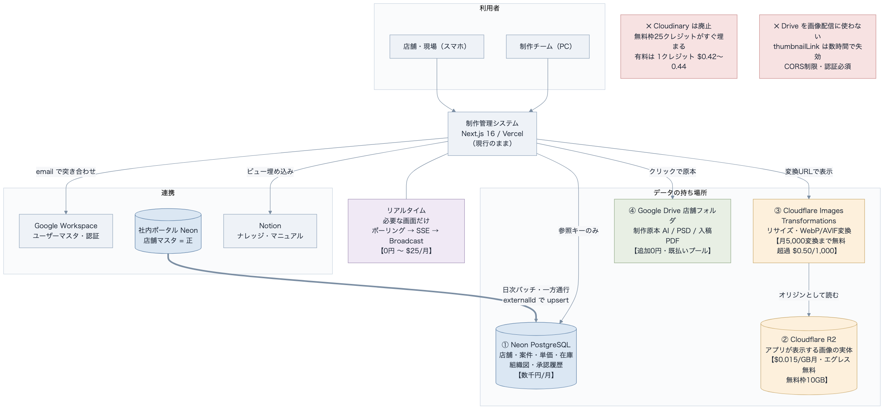
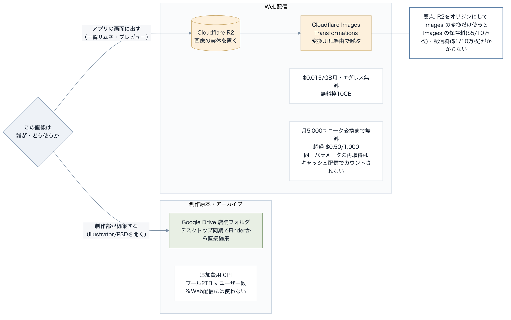

# 制作システム データアーキテクチャ — 「何をどこに持たせるか」 2026-09-03

阿部さんの問い（2026-09-03 LINE）への回答。**実際のリポジトリ（`hassin84design-hash/seisaku-system`）のスキーマを読んだ上での結論**です。
料金は2026年9月時点の公開価格。為替は **1USD＝150円** で概算。

---

## 0. 結論（先に4行）

> **2026-09-03 改訂**: NotebookLM の deep research（77ソース）で裏取りした結果、**Cloudinary を残す案を撤回**。阿部さんの確認（「無料枠はすぐ埋まるのでアウト」）と合わせ、**Cloudflare R2 ＋ Cloudflare Images に置き換える**のが答えです。

1. **Cloudinary は廃止する**。無料枠25クレジットは実運用ですぐ埋まり、有料は1クレジット **$0.42〜0.44**（3TB規模で年200万円級）。
2. **代替は Cloudflare R2 ＋ Cloudflare Images の Transformations**。R2 を画像のオリジンにして Images の**変換だけ**を使うと、Images の保存料・配信料がかからない。**月5,000ユニーク変換まで無料**で、Cloudinary の役割（リサイズ・WebP/AVIF変換・CDN配信）をそのまま置き換えられる。**制作原本（AI/PSD）は Google Drive に置いたまま**。
3. **店舗マスタ連携は「直接接続」ではなく「ポータルを正として同期」**。制作システムの `Store.id` を7つのテーブルが外部キーで参照しているため、外部DBへの置き換えは事実上できない。
4. **リアルタイム同期のためにDBをSupabaseへ移す必要はない**。Supabase Realtime の Broadcast／Presence は**DB非依存で使える**。移行が必須なのは Postgres Changes だけ。まずはポーリング → Neon の LISTEN/NOTIFY＋SSE の順で段を上げる（どちらも追加費用ゼロ）。

**→ 最終構造は §9。**

---

## 1. 現状のアーキテクチャ（実装から確認）

### スタック

| レイヤー | 実体 | 確認元 |
|---|---|---|
| アプリ | **Next.js 16.2.10 / React 19.2.4 / TypeScript / Tailwind 4** | `package.json` |
| ORM | **Prisma 6.19.3** | `package.json` |
| DB | **PostgreSQL（Neon）** `DATABASE_URL` ＋ `DIRECT_URL` | `prisma/schema.prisma` |
| 認証 | **next-auth v5 (beta)** ＋ 自前の `AllowedUser` テーブル | `package.json` / schema |
| 画像・ファイル | **Cloudinary**（`cloudinary` v2.10） | 6ファイルで利用 |
| 帳票 | exceljs | `package.json` |
| 外部連携 | **Notion API**（`NOTION_TOKEN` / `NOTION_DATABASE_ID` / `NOTION_PARENT_PAGE_ID`） | env参照 |
| ホスティング | Vercel | `vercel.json` |

**開発は活発**。マイグレーション**46本**、最新は 2026-09-02（＝定例の前日）。

### データモデルの規模

**50モデル・24 enum・1,266行**。素人の作りものではなく、業務システムとして筋の通った設計です。

主要な骨格:

- **組織・場所**: `Company`（運営会社）→ `Division`（営業部。第一〜第八のほかイニシエート・HASSIN等）→ `Store`（店舗）。別軸で `Brand` → `BrandCategory`
- **案件**: `Project` → `ProjectImage` / `ProjectDelivery` / `DesignConfirmationTarget` / `WorkLog`
- **原価・請求**: `Product` → `ProductItem` / `UnitPrice` / `Invoice` → `InvoiceLine`
- **人**: `AllowedUser`（ログイン）／ `Worker`（稼働）／ `WorkerRate` / `WorkerDayStatus` / `DailyReport`
- **依頼受付**: `Request` → `RequestAttachment` / `RequestApproval`（`RolePriority` で承認順を制御）
- **ブランドアーカイブ**: `DesignAsset` → `AssetVersion` → `AssetFile`（多対多で `AssetStore`、タグは `Tag`）
- **企画**: `GroupPlan` → `GroupPlanImage` / `GroupPlanSubmission` / `GroupPlanPost`

### 画像・ファイルの持ち方（ここが論点）

Cloudinary への依存が**6テーブル**に直接書かれています。

| テーブル | 列 | 削除できるか |
|---|---|---|
| `ProjectImage` | `publicId` `url` `resourceType` `fileName` `mimeType` `fileSize` | ✅ できる |
| `RequestAttachment` | `publicId` `url` | ✅ |
| `GroupPlanImage` | `publicId` `url` `resourceType` | ✅ |
| `GroupPlanSubmissionImage` | `publicId` `url` | ✅ |
| `GroupPlanPost` | `imageUrl` | ⚠️ キーが無い |
| `AssetFile` | **`fileUrl` のみ** | ❌ **できない** |

> ⚠️ **実装上の指摘**: `AssetFile`（ブランドアーカイブの成果物ファイル）は `publicId` を持っていません。**DBから消してもCloudinary側の実体が残り続けます**（容量が戻らない）。ブランドアーカイブは3TBの主犯になりうる場所なので、ここは早めに直す価値があります。`GroupPlanPost.imageUrl` も同じ形です。

### アップロードの実装

`docs/cloudinary連携_設定手順.md` によると、**アップロード時に長辺2000pxまで自動縮小・圧縮**しています。設計者は容量を意識しています。環境変数が未設定なら機能オフになるフォールバックもあり、**置き場の差し替えを想定した作りになっています**（＝乗り換えコストが低い）。

---

## 2. 「3TB」の検算 — ここが最大の分岐点

議事録では「Cloudinary の容量は3TB、年間1TB弱ずつ増加」とありました。**この数字は Cloudinary の無料プランでは成立しません。**

- Cloudinary の課金単位は**クレジット**。**1クレジット ＝ 保存1GB ＝ 配信1GB ＝ 変換1,000回**のいずれか
- **無料プランは月25クレジット**（≒25GB相当）。3TB＝3,000GBは**120倍**

つまり「3TB」は、**Cloudinary に入っている量ではなく、制作物データ全体の量**（Driveやローカル・NASを含む総量）を指している可能性が高い。

> ✅ **確認済み（2026-09-03 阿部さん）**: 「**無料枠はすぐ埋まるのでアウト**」。よって Cloudinary を配信サムネ専用に絞って無料枠で回す案は**成立しません**。代替は §3.5 の **R2 ＋ Cloudflare Images**。

### 仮に3TBをそのまま各サービスで持ったら（月額・概算）

| 置き場 | 単価 | 3,000GBの月額 | 年額 | 転送料 |
|---|---|---|---|---|
| **Neon（DBに入れる）** | $0.35/GB月 | $1,050 ≒ **15.8万円** | 189万円 | — |
| **Cloudinary** | **$0.415〜0.44/クレジット**（Plus $99/225・Advanced $249/600） | 約$1,245〜1,320 ≒ **19〜20万円** | **224〜238万円** | クレジット共通で食う |
| **Vercel Blob** | $0.023/GB月 | $69 ≒ 1.0万円 | 12万円 | $0.05/GB（別課金） |
| **Cloudflare R2** | $0.015/GB月 | $45 ≒ **0.68万円** | **8.1万円** | **$0（無料）** |
| **Google Drive（Workspace）** | プール2TB/ユーザー | **追加ゼロ**（既払い） | — | — |

**年1TB増えるとどうなるか**: R2 は月+$15（+2,250円）、Cloudinary は月+$380（+5.7万円）、Drive はプール内なら**ゼロ**。

**結論として動かせない事実が2つ**:
- **画像をDBに入れるのは論外**（Neonのストレージ単価はR2の23倍）
- **アーカイブ保管をCloudinaryでやるのは高すぎる**（R2の25倍）。Cloudinaryの価値は変換・配信であって保管ではない

---

## 3. 選択肢の比較（2026年9月の公開価格）

| サービス | 得意 | 料金 | 本件での評価 |
|---|---|---|---|
| **Neon（現行DB）** | PostgreSQL。ブランチ機能・スケールゼロ | Free: 0.5GB/100CU時。Launch $0.106/CU時、Scale $0.222/CU時、ストレージ$0.35/GB月 | **◎ 継続**。構造化データ専用に保つ |
| **Supabase** | Postgres＋認証＋ストレージ＋Realtimeが一体 | Pro **$25/月/組織**（DB 8GB・ストレージ100GB＋超過$0.021/GB月・エグレス Uncached 250GB＋Cached 250GB／超過$0.09・$0.03/GB。**Realtime 500同時接続＋500万msg/月**、超過$10/1,000接続・$2.50/百万msg）。追加プロジェクトは1つ$10/月〜 | **△ DB移行は不要**。認証は Google Workspace 主体と決めており Auth の旨味が薄い。46本のマイグレーションを載せ替える価値がない。**Realtime だけ部分導入する余地はある（§5.5）** |
| **Cloudflare R2** | S3互換オブジェクトストレージ。**エグレス無料** | $0.015/GB月。Class A $4.50/百万、Class B $0.36/百万。**無料枠: 10GB＋Class A 100万＋Class B 1,000万/月** | **◎ Web配信する画像の実体はここ**。エグレス無料が効く |
| **Cloudflare Images**（Transformations） | 画像のリサイズ・WebP/AVIF変換をオンザフライで | **変換 $0.50/1,000ユニーク変換（月5,000まで無料）**。保存 $5/10万枚、配信 $1/10万枚 | **◎ Cloudinary の置き換え**。**R2をオリジンにすれば保存料・配信料はかからず、変換数だけの課金**。同一パラメータの再取得はキャッシュ配信でカウントされない |
| **Cloudinary（現行）** | 画像の変換・最適化・CDN配信 | 無料25クレジット／Plus $99月（225）／Advanced $249月（600）。超過は $0.40〜0.45/クレジット | **✕ 廃止**。無料枠はすぐ埋まる（確認済み）。実効単価 $0.415〜0.44/クレジットは R2 の28倍以上 |
| **Vercel Blob** | Vercelと同居で実装が最短 | $0.023/GB月＋転送$0.05/GB | **△** 保管はR2より高く、転送も課金。同居の楽さだけでは選べない |
| **Google Drive（Workspace）** | 現場が普段使い。**プール2TB/ユーザー（Business Standard $14/ユーザー月）・5TB（Plus $22）** | **既に有料化済み＝追加費用ゼロ** | **◎ 原本・アーカイブの本命**。ただしアプリの配信基盤には向かない（下記） |
| **Cloudflare Workers（ホスティング）** | エッジ実行 | — | **△ 今は触らない**。Next.js 16＋Prismaの構成をVercelから動かす利点が現時点でない |

### ⚠️ Google Drive をアプリの画像配信に使えない理由（裏取り済み・当初の想定より厳しい）

「原本をDriveに寄せる」は正しいですが、**Driveの画像をアプリの画面に直接出すのは設計として成立しません**。理由は3つで、いずれも回避策が重い。

1. **`thumbnailLink` の有効期限は「数時間」**（当初「約1日」と書いていたが、実際はもっと短い）。DBにURLを保存する現在の作りと根本的に噛み合わない
2. **CORS制限がかかるよう設計されている**。Webアプリから直接ロードできず、**プロキシサーバーを挟むことが公式に推奨**されている
3. **認証情報つきのリクエストが必須**（ファイルを完全公開しない限り）。素の `` タグでは表示できない

**クォータ**（2026-05-01 から新モデル）: プロジェクトあたり**1分100万クォータユニット**、ユーザーあたり**1分32.5万ユニット**、プロジェクトあたり**1日1TBのエグレス上限**。単価は 読み取り5・リスト100・**ダウンロード200**ユニット。※旧プロジェクトには従来の「1ユーザー60秒あたり12,000クエリ」も適用。
→ 一覧100件のサムネを毎回Driveから引くと `list 100 + download 200×100 = 20,100ユニット`。回数が増えると効いてきます。

→ **結論: Driveは「制作部がFinderで開く原本の置き場」に限定し、Web配信は R2 ＋ Cloudflare Images に分ける。**（→ §3.5）

---

## 3.5 Cloudinary の代替 — R2 ＋ Cloudflare Images（本命）

**Cloudflare Images には2つの使い方があり、安いのは後者です。**

| 使い方 | 課金 | 本件 |
|---|---|---|
| Images に画像を**保存**して配信 | 保存 $5/10万枚 ＋ 配信 $1/10万枚 ＋ 変換 | 使わない |
| **外部（R2）をオリジンにして変換だけ使う**（Remote Images / Transformations） | **変換のみ $0.50/1,000ユニーク変換。月5,000まで無料** | ✅ **これ** |

**組み方**

1. 画像の実体は **R2** に置く（$0.015/GB月・**エグレス無料**・無料枠10GB）
2. 画面に出すときは **Cloudflare Images の変換URL経由**で呼ぶ（リサイズ・WebP/AVIF変換がオンザフライ）
3. **同一画像に同じパラメータのリクエストはキャッシュから配信され、2回目以降は変換としてカウントされない** → 実際に課金対象になるのは「新しい画像 × 使うサイズの種類」の数だけ

これで **Cloudinary がやっていたこと（変換・最適化・CDN配信）をそのまま置き換えられます。** しかも Images の保存料・配信料はかかりません。

**費用の目安**: Web表示する画像が仮に300GBなら R2 は月$4.5（約680円）。変換は月5,000ユニークまで無料で、超えても $0.50/1,000。**合わせて月1,000円未満**に収まる見込みです。

> 既存の実装は「アップロード時に長辺2000pxまで自動縮小」しており、環境変数が未設定なら機能オフになるフォールバックも入っています。**置き場の差し替えを前提にした作りなので、移行コストは低い**はずです（§4の抽象化と同時にやる）。

---

## 4. 推奨アーキテクチャ

### 用途で4つに割る

| 層 | 中身 | 置き場 | 理由 |
|---|---|---|---|
| **① 構造化データ** | 店舗・案件・単価・在庫・組織図・承認履歴 | **Neon（現行のまま）** | 検索・集計・整合性。Prismaスキーマは既に良く出来ている。動かさない |
| **② Web配信する画像の実体** | 完成イメージ写真、アーカイブのギャラリー用画像 | **Cloudflare R2** | $0.015/GB月・**エグレス無料**・無料枠10GB |
| **③ 画像の変換・配信** | 一覧サムネ、画面プレビュー（リサイズ・WebP/AVIF） | **Cloudflare Images（Transformations）** | R2をオリジンにすれば**変換数だけの課金・月5,000まで無料**。Cloudinaryの役割をそのまま置き換え |
| **④ 制作原本・アーカイブ** | Illustrator/PSD、入稿PDF、撮影素材 | **Google Drive（店舗フォルダ）** | 容量がプールで追加ゼロ。**制作部がFinderから直接開いて編集できる**。権限をWorkspaceで回せる |

DBには**参照キーだけ**を持たせます（実体は持たない）。

### 「Driveに全部」でも「R2に全部」でもない理由

- **Driveに全部** → Web配信ができない。`thumbnailLink` が数時間で失効し、CORS制限と認証必須で `` に出せない（§3）
- **R2に全部** → 費用は最安だが、**制作部が Illustrator/PSD を日常的に開いて編集する**。R2はアプリ経由でしか触れないので現場の作業が止まる

→ **Web配信するものはR2、人が直接編集するものはDrive。** この線引きが答えです。

### 実装の変更点（DBの抽象化）

いま `publicId` / `url` がCloudinary前提で6テーブルに散っています。ここを差し替え可能にします。

```
現在  : publicId String / url String / resourceType String
        （AssetFile は fileUrl のみ ＝ 削除できない）

推奨  : storageProvider String   -- "r2" | "drive"（移行期は "cloudinary" も許容）
        storageKey      String   -- R2のオブジェクトキー（publicIdの一般化。削除に使う）
        driveFileId     String?  -- ④Driveの原本ID（「クリックで原本を開く」用）
        fileName / mimeType / fileSize

  表示URLはDBに保存しない。storageKey から Cloudflare Images の
  変換URLを組み立てる（サイズ違いは同じキーから何通りでも作れる）。
```

得られること: ①置き場を替えてもスキーマ手術が不要 ②`AssetFile` と `GroupPlanPost` の**削除できない問題が同時に直る** ③一覧はサムネ、クリックで原本（Drive）という議事録の要望がそのまま表現できる ④**表示URLをDBに持たないので、サイズ違いを後から増やしてもマイグレーション不要**。

**共通テーブルへの統合は推奨しません**。6テーブルそれぞれリレーション先が違い、46本のマイグレーション履歴もあるため、列の追加で揃えるのが安全です。

---

## 5. 店舗マスタ連携 — 結論が変わります

先行整理では「a: 直接接続」「c: 単一DBに統合」が本命とされていましたが、**実スキーマを読むと a は選べません**。

**理由**: 制作システムの `Store` は自前の実テーブルで、**7つのテーブルが `Store.id` を外部キーで参照**しています（`Project` `Invoice` `AssetStore` `NewStoreSchedule` `MenuSchedule` `Request` `AllowedUser`＋担当範囲の多対多）。外部DBのテーブルやビューを参照先にすると、**Prismaの外部キー制約が張れません**。

| 案 | 実現可否 | 評価 |
|---|---|---|
| a. ポータルのNeon DBへ直接接続（読み取り専用ロール／ビュー） | **❌ 不可** | ビューはFKの参照先になれない。既存7リレーションが壊れる |
| b. **ポータルを正（SoT）として制作システムへ同期** | **✅ 可** | **本命**。既存スキーマを壊さない。制作システム側の店舗編集UIを読み取り専用にする |
| c. 単一DBに統合し両アプリが同じ接続を使う | △ 可能だが重い | FKは張れるが、2アプリのスキーマ統合＋46本のマイグレーション整合が必要。1ヶ月のスコープに入らない |

### 案b の実装手順

1. **`Store.externalId String? @unique` を追加**（ポータル側の店舗IDを入れる）
   - ⚠️ 現在 `externalId` は `AllowedUser` にだけあり「将来、外部の店舗管理システムと連携する際に紐付けるための外部ID（今回は未使用）」とコメント付き。**`Store` には無い**。ここが連携の入口
   - 同じものを `Company` `Division` にも足す（階層ごと同期するため）
2. **同期の向きを一方通行に固定**（ポータル → 制作システム）。制作システム側の店舗マスタ編集画面は読み取り専用にする
3. **同期方式**: まずは日次バッチ（Vercel Cron）で `externalId` を突き合わせて upsert。閉店は物理削除せず `status: CLOSED`（既存の `StoreStatus` がそのまま使える）
4. **リアルタイム性が必要になったら**ポータル側から Webhook を足す（段階的に。最初から作らない）
5. **組織図・承認者**は既存の `RolePriority` / `RequestApproval` / `Department` で表現できるので、**新規テーブルは足さずに既存の枠に載せる**

### ユーザーマスタ

`AllowedUser` は既に `email` / `role` / `storeId` / `departmentId` / 担当範囲スコープ（`scopeDivisionId`・`scopeStores`）を持ち、**`externalId` も用意済み**。Google Workspace のディレクトリと `email` で突き合わせれば繋がります。Workspace の全ユーザー移行が今月中なので、**設計確定後（9/18定例後）に着手**が現実的。

---

## 5.5 リアルタイム同期 — Supabaseは「必須」ではない

加藤（梨紗）さんからの追加論点:
> 「リアルタイム同期」は、複数人が同じ画面・同じデータを同時に見ている状態で、誰かの操作が他の人の画面にも即座に（リロードなしで）反映される仕組みが必要な場合はSupabaseが必要な模様

**方向は合っていますが、DB移行までは要りません。** 3段階に切り分けると、上の2段は現行構成のまま追加費用ゼロで実現できます。

| 段 | 手段 | 追加費用 | 適する場面 |
|---|---|---|---|
| **①ポーリング** | SWR / React Query の再検証（10〜30秒間隔） | **0円** | 「数十秒遅れて反映」で足りる画面。進捗%・出勤状況・案件一覧・引き継ぎ連絡ボード |
| **②Neon LISTEN/NOTIFY ＋ SSE** | Postgres の `NOTIFY` をサーバーで購読し、SSEでブラウザへ押し出す | **0円**（Neon・Vercelのまま） | 通知・アクティビティフィード・カウンタ。小〜中規模のfan-out |
| **③専用リアルタイム基盤** | Supabase Realtime / Ably / Pusher | Supabase Pro **$25/月**（500同時接続・500万メッセージ込み。超過は$10/1,000接続・$2.50/百万メッセージ） | 数百同時接続、双方向、同じレコードの共同編集、誰が見ているかの表示 |

### ②の制約（事実として押さえる）

- `LISTEN` は**1リスナー＝1接続**（プール接続ではなく直結の接続文字列が必要）
- `NOTIFY` のペイロードは**8,000バイト上限**、fire-and-forget（永続キューではない）
- SSEは**片方向**（サーバー→クライアント）。クライアントからの送信は通常のAPIで行う
- Vercel Pro の関数は Fluid compute で**最大800秒**（beta 1800秒）→ SSE接続はその時間で切れるが、`EventSource` は**自動再接続する**
- 高スケール（数千同時）や双方向の共同編集には向かない

### ③でSupabaseを使う場合の重要な区別

| Supabase Realtime の機能 | DBがSupabaseである必要 | 本件での使い方 |
|---|---|---|
| **Postgres Changes**（DBの変更を自動購読） | **必要**（Postgres の WAL を購読するため） | ❌ DB移行が必須になる。採らない |
| **Broadcast**（アプリが明示的にメッセージを送る） | **不要** | ✅ **Neonのまま Supabase Realtime だけ薄く足せる** |
| **Presence**（誰が見ているかの共有状態） | **不要** | ✅ 同上 |

**つまり「リアルタイムが欲しい＝DBをSupabaseへ移す」ではありません。** Broadcast なら現行DBを一切触らずに実現できます。ここが今回いちばん誤解されやすい点です。

### 進め方（段を上げる順番）

1. **本当にリアルタイムが必要な画面を1〜2枚に絞る。** 全画面リアルタイムは不要で、かつ高くつく
2. その画面で**①ポーリング10〜30秒**を試す。制作部の使い方なら大半はここで足りる
3. 足りなければ**②Neon LISTEN/NOTIFY ＋ SSE**（追加費用ゼロ）
4. 「同じレコードを2人が同時に編集」「誰が見ているか出したい」が実要件になったら、**③Supabase Realtime の Broadcast／Presence を部分導入**（DBは移さない）

**決定: DBはNeonのまま。リアルタイムは必要な画面だけ、①→②→③の順で段を上げる。**

---

## 6. 費用まとめ（推奨構成／月額）

| 項目 | 費用 | 備考 |
|---|---|---|
| Neon（構造化データのみ） | 数千円〜（Launch想定） | 画像を入れなければ容量は伸びない |
| **Cloudflare R2**（Web配信する画像の実体） | **月$4.5＝約680円**（300GB想定） | 無料枠10GB。**エグレス無料**。3TB全部入れても月$45＝6,750円 |
| **Cloudflare Images**（変換・配信） | **0円**（月5,000ユニーク変換まで） | 超過 $0.50/1,000。同一パラメータの再取得はカウントされない |
| Google Drive（制作原本・アーカイブ） | **0円（追加）** | Workspace有料化で確保済みのプールを使う |
| Vercel（ホスティング） | 現状のまま | 触らない |
| ~~Cloudinary~~ | **廃止** | 無料枠がすぐ埋まる。有料は実効 $0.415〜0.44/クレジット＝R2の28倍以上 |
| **合計の追加費用** | **月1,000円未満の見込み** | |

**画像が増えたときの伸び方**: R2 は 1TB増えて月+$15（+2,250円）だけ。Cloudinary なら月+$400以上（+6万円）でした。**ここが乗り換える一番の理由**です。

---

## 7. 小さな検証（提案の前にこれをやる）

| # | 検証 | 見たい答え | 工数目安 |
|---|---|---|---|
| 1 | ~~Cloudinary の実使用クレジット数を見る~~ | ✅ **完了**（2026-09-03・「すぐ埋まるのでアウト」と確認） | — |
| 2 | **R2 にテスト画像を置き、Cloudflare Images の変換URL経由で表示できるか試す** | サムネ表示の体感速度と、変換カウントの実際の消費 | 半日 |
| 3 | Drive の共有権限を店舗単位で切れるか（未Googleアカウント者の閲覧含む）＋「クリックで原本を開く」導線 | 店舗側にアーカイブを公開できるか。※Driveから画像は出さない | 半日 |
| 4 | ポータル側Neonのスキーマを読み、`Store` に相当するテーブルと主キーを特定 | 案bの同期キー（`externalId`）に何を入れるか | 半日（Neon招待の404解消が前提） |
| 5 | `AssetFile` / `GroupPlanPost` に `storageKey` を足す小さなPR | 削除できない問題の解消。R2移行の第一歩 | 半日 |
| 6 | 既存 Cloudinary 画像を R2 へ移す移行スクリプト（`publicId` → `storageKey`） | 移行の所要時間と失敗パターン | 1日 |

**前提となる詰まり**: Neon招待が404、Vercel招待が阿部さん宛。#4はここが解けないと進みません。

---

## 8. 9/18定例に持ち込む4点

1. **Cloudinary をやめて Cloudflare R2 ＋ Images に移す**という方針の合意（追加費用は月1,000円未満の見込み）
2. **①構造化=Neon／②画像の実体=R2／③変換配信=Images／④制作原本=Drive の4層**の線引き。**Web配信するものはR2、人が直接編集するものはDrive**
3. **店舗マスタ連携は案b（ポータルを正として同期）**。`Store.externalId` の追加から始める。※先行整理の「a か c」から結論を変更（理由は§5）
4. **リアルタイムが必要な画面はどれか**を1〜2枚に絞る。DBはNeonのままで、ポーリング→SSEの順で段を上げる（§5.5）

---

## 9. 最終構造（決定版）




| 層 | 採用 | 追加費用 | 動かさない理由／条件 |
|---|---|---|---|
| **構造化データ** | **Neon PostgreSQL**（現行のまま） | 数千円/月 | 50モデル・46マイグレーションが載っている。移行の利得なし |
| **Web配信する画像の実体** | **Cloudflare R2** | 約680円/月（300GB想定） | $0.015/GB月・**エグレス無料**・無料枠10GB。3TB全部でも6,750円/月 |
| **画像の変換・配信** | **Cloudflare Images（Transformations）** | **0円** | R2をオリジンにすれば変換数だけの課金。**月5,000ユニーク変換まで無料**。同一パラメータの再取得はカウントされない |
| **制作原本・アーカイブ** | **Google Drive**（店舗フォルダ） | **0円**（既払いのプール） | 制作部がFinderから直接編集できる。権限をWorkspaceで回せる。**Web配信には使わない** |
| **認証・ユーザーマスタ** | **Google Workspace ディレクトリ** ＋ `AllowedUser.email` で突き合わせ | **0円** | Workspace全ユーザー移行が今月中。設計確定後（9/18定例後）に着手 |
| **店舗マスタ** | **社内ポータルを正（SoT）**、日次バッチで一方通行同期 | **0円** | `Store.externalId` を追加。制作システム側の店舗編集UIは読み取り専用に |
| **ナレッジ** | **Notion**（`NOTION_TOKEN` で既に連携済み） | **0円** | 制作部は共有アカウントで全員在籍。ビューを埋め込む |
| **リアルタイム** | 必要な画面だけ。**①ポーリング → ②Neon LISTEN/NOTIFY＋SSE → ③Supabase Broadcast** | **0円**〜$25/月 | ③に上がっても**DBは移さない**（Broadcast／Presence はDB非依存） |
| **ホスティング** | **Vercel**（現行のまま） | 現状 | Cloudflare Workers へ動かす利点が現時点でない |

**総額の追加費用: 月1,000円未満の見込み。** リアルタイムで③まで上がった場合のみ月$25（約3,750円）が乗ります。

### 採らなかった選択肢と理由

| 却下した案 | 理由 |
|---|---|
| **Cloudinary を続ける** | 無料枠25クレジットは実運用ですぐ埋まる（2026-09-03 確認済み）。有料の実効単価 $0.415〜0.44/クレジットは **R2の28倍以上**。3TB規模で年224〜238万円 |
| 画像をNeon（DB）に入れる | ストレージ単価 $0.35/GB月＝R2の23倍。**論外** |
| **Drive の画像をアプリに直接表示** | `thumbnailLink` が**数時間で失効**、**CORS制限がかかる設計**（公式にプロキシ推奨）、**認証つきリクエストが必須**で素の `` では出せない |
| R2に原本も全部入れる | 最安だが**制作部がIllustrator/PSDを直接開けない**。現場の作業が成立しない |
| Cloudflare Images に画像を保存して配信 | 保存 $5/10万枚＋配信 $1/10万枚がかかる。**R2をオリジンにすれば両方不要** |
| DBをSupabaseへ移行 | 認証はWorkspace主体と決めておりAuthの旨味が薄い。46本のマイグレーションを載せ替える価値がない。Realtimeも Broadcast なら移行不要 |
| Vercel Blob | 保管はR2より高く（$0.023 vs $0.015）転送も別課金（$0.05/GB） |
| Cloudflare Workers へ移行 | Next.js 16＋Prisma を動かす利点が現時点でない。制作システムを1ヶ月で仕上げるスコープに入らない |

---

## 出典（2026年9月時点の公開価格）

- Cloudinary 料金・クレジット定義 — [theimagecdn.com](https://theimagecdn.com/docs/cloudinary-pricing) / [costbench.com](https://costbench.com/software/digital-asset-management/cloudinary/free-plan/)
- Cloudflare R2 料金 — [egresscost.com](https://egresscost.com/cloudflare/) / [budgetforge.dev](https://www.budgetforge.dev/tools/cloudflare-r2-pricing-2026)
- Neon 料金 — [comparedge.com](https://comparedge.com/tools/neon-db/pricing) / [prisma.io](https://www.prisma.io/blog/prisma-postgres-vs-neon-pricing-2026)
- Supabase 料金 — [makerkit.dev](https://makerkit.dev/blog/saas/supabase-pricing) / [uibakery.io](https://uibakery.io/blog/supabase-pricing)
- Vercel Blob 料金 — [vercel.com/docs](https://vercel.com/docs/vercel-blob/usage-and-pricing)
- Google Workspace プール容量 — [workspace.google.com/pricing](https://workspace.google.com/pricing) / [knowledge.workspace.google.com](https://knowledge.workspace.google.com/admin/getting-started/editions/compare-business-editions)
- Google Drive API 制限・thumbnailLink — [developers.google.com](https://developers.google.com/workspace/drive/api/guides/limits)
- Neon の WebSocket／SSE・LISTEN/NOTIFY — [neon.com/docs](https://neon.com/docs/compute/functions/websockets) / [neon.com/guides](https://neon.com/guides/real-time-comments)
- Postgres LISTEN/NOTIFY の制約 — [pedroalonso.net](https://www.pedroalonso.net/blog/postgres-listen-notify-real-time/)
- Supabase Realtime の Broadcast／Presence と Postgres Changes の違い — [supabase.com/docs](https://supabase.com/docs/guides/realtime/concepts) / [supabase.com/blog](https://supabase.com/blog/supabase-realtime-broadcast-and-presence-authorization)
- Supabase Realtime の同時接続・メッセージ上限 — [uibakery.io](https://uibakery.io/blog/supabase-pricing) / [flexprice.io](https://flexprice.io/blog/supabase-pricing-breakdown)
- Vercel 関数の最大実行時間（Fluid compute） — [vercel.com/docs](https://vercel.com/docs/functions/configuring-functions/duration)

- Cloudflare Images 料金（変換・保存・配信） — [developers.cloudflare.com/images/pricing](https://developers.cloudflare.com/images/pricing/)
- Cloudflare R2 料金（公式） — [developers.cloudflare.com/r2/pricing](https://developers.cloudflare.com/r2/pricing/)
- Google Drive API クォータ（2026-05-01 の新モデル） — [developers.google.com](https://developers.google.com/workspace/drive/api/guides/limits)
- Supabase 超過単価 — [flexprice.io](https://flexprice.io/blog/supabase-pricing-breakdown)

> **調査手段**: 2026-09-03 に **NotebookLM の deep research（77ソース）で裏取り済み**。ノートブック `e8ae7e34-05eb-456d-a236-b5a28da94efc`「HASSIN制作システム データ基盤の料金裏取り 2026-09」。
> 裏取りで**変わった点**: ①Cloudinary の実効クレジット単価は $0.38 ではなく **$0.415〜0.44** ②**Cloudflare Images の Transformations**（R2オリジン・変換のみ課金・月5,000無料）という選択肢の存在 ③Drive の `thumbnailLink` は「約1日」ではなく**数時間**で、さらに**CORS制限と認証必須**という当初把握していなかった制約。
> ※`nlm login` は Chrome 起動中だと自前の隔離プロファイルを使えず失敗します（`Profile isolation may not apply` の警告が出て、見た目は成功でもAPIに弾かれる）。**Chrome を完全終了してから実行**してください。また nlm 自体が古いと NotebookLM の「Gemini Notebook」改名・ドメイン変更に追随できません（0.8.6→0.10.0 で解消）。
